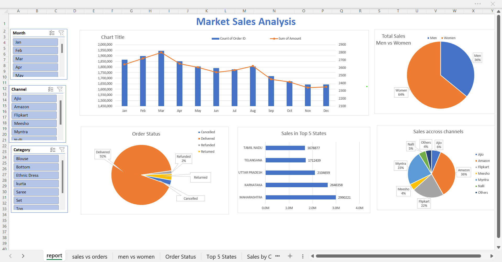

# Market Sales Analysis Dashboard

### 1. Background and Overview
This dashboard is a case study based on a dataset from a Retail Solutions, a e-commerce company specializing in apparel sales across India. The dataset, crafted for this project, includes customer orders from diverse states, processed through popular channels like Myntra, Amazon, Ajio, and others, with details on order status (delivered, returned, cancelled, or refunded) and product categories. My journey began with a raw Excel file, and through this project, I explored data cleaning, transformation, and visualization to create a comprehensive dashboard. This exercise allowed me to simulate real-world retail challenges and develop a Solution that could support strategic decision-making, reflecting my growth in data analysis and presentation skills.

#### 1.5 Data Cleaning
The data cleaning process involved addressing various irregularities in the dataset.  For instance, the Gender column contained inconsistent entries such as 'M', 'F', 'Male', and 'Female', which I standardized to 'Men' and 'Women'. City names like 'Mumbai' and 'Mum' were unified to a single format. I also ensured a proper date format was applied to the Date column and derived the Month column from it for easier analysis. Additionally, I corrected the data type of the Qty column from text to integer to enable accurate calculations.
### 2. Executive Summary

|Column Name|Data Type|
|---|---|
|Index|Integer|
|Order ID|Text|
|Cust ID|Integer|
|Gender|Text|
|Age|Integer|
|AgeGroup|Text|
|Date|Date|
|Month|Text|
|Status|Text|
|Channel|Text|
|SKU|Text|
|Category|Text|
|Size|Text|
|Qty|Integer|
|Currency|Text|
|Amount|Decimal|
|ship-city|Text|
|ship-state|Text|
|ship-postal-code|Integer|
|ship-country|Text|
|B2B|Boolean|

### 3. Insights

My journey with this dataset revealed several key trends that shaped the dashboard's development.  
The analysis showed a significant peak in sales during March and April, followed by a sharp decline from July to December, suggesting seasonal influences or potential market saturation that warranted further investigation.  
A deep dive into gender data highlighted that women’s products accounted for 64% of total sales, indicating a strong female customer base, while the adult age group dominated purchases, reflecting the target demographic.  
Order status analysis uncovered that 92% of orders were successfully delivered, with only 2% refunded and a similar percentage returned, pointing to high customer satisfaction but also room for reducing returns.  
Regionally, Tamil Nadu and Karnataka emerged as top-performing states, contributing substantial revenue, likely due to better logistics or market penetration.  
Channel-wise, Amazon and Myntra stood out as primary drivers, with their combined influence suggesting a reliance on established e-commerce platforms.  
The process of creating the dashboard also involved overcoming challenges like inconsistent data entries and learning to align visualizations with business questions, making it a rich learning experience.

### 4. Recommendations

Based on the insights gained, my project journey led me to propose several strategic recommendations.  
To capitalize on seasonal trends, I suggest intensifying marketing and inventory planning for the March-April period, potentially introducing promotions to sustain momentum.  
The gender imbalance in sales prompted me to recommend targeted campaigns for men’s products, possibly exploring new designs or collaborations to tap into this underserved segment.  
For regional success, I advise deepening operational investments in Tamil Nadu and Karnataka, such as localized marketing or enhanced delivery networks, while analyzing underperforming states to identify barriers.  
The low refund and return rates are encouraging, but I recommend conducting customer feedback surveys to further minimize returns, possibly by improving product descriptions or sizing guides. 
Additionally, strengthening partnerships with Amazon and Myntra could involve exclusive launches or loyalty programs, while exploring emerging channels like Ajio to diversify revenue streams. 
